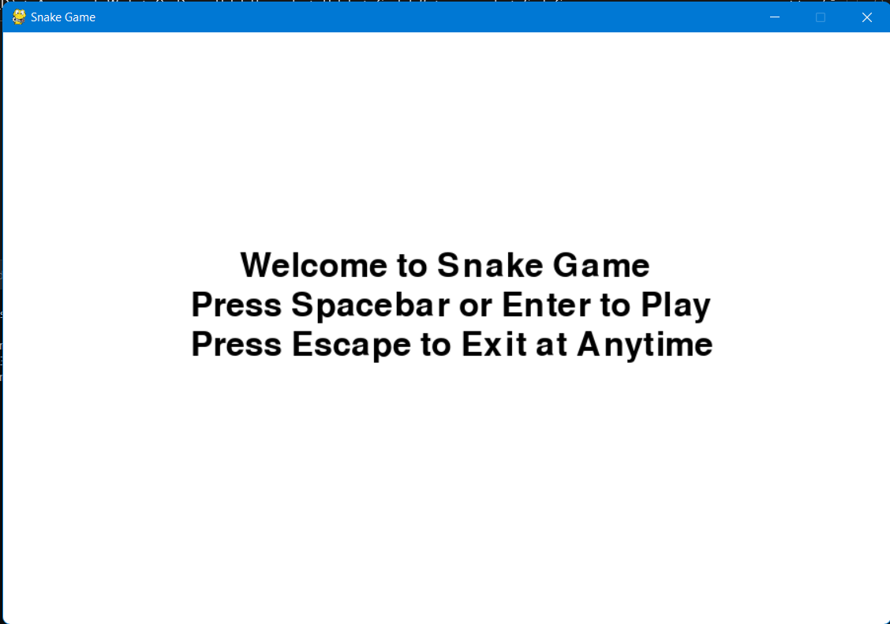

# SnakeGame  

This is a simple copy of the classic snake game we all used to love and play on our keypad mobile phones like Nokia and Blackberry.
The game is made using Python3.11, however, it can be made on any python version above 3.6 and the Pygame module.

This can be used to make your own snake game as well. Hope you like it.

-------------------------------------------------------------
## Requirements:
You will obviously require the pygame module. 
<br/>
To install the pygame module:
* Open the Terminal/PowerShell/Command Prompt
* Run: ```pip install pygame``` or ```pip3 install pygame```
----------------------------------------------------------

## To play the Game:
Just simply extract all the files in a folder, navigate to the directory and run the snakegame.py file in the directory (you will need the .txt files as well as they keep high scores).
<br/>
Also I'm confused how to create a .exe file as pyinstaller does not work for me due to other modules that I can't delete... so if anyone can help me with the .exe file, that would be awesome.

#### Home Screen


### Game Play:
<video controls>
    <source src="gameplay.mp4" type="video/mp4">
    Your browser does not support the video tag
</video>

------------------------------------------------------------

### Thank you!
